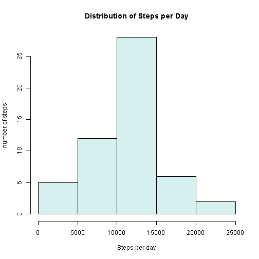
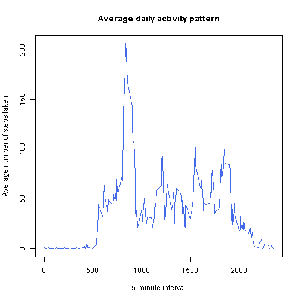
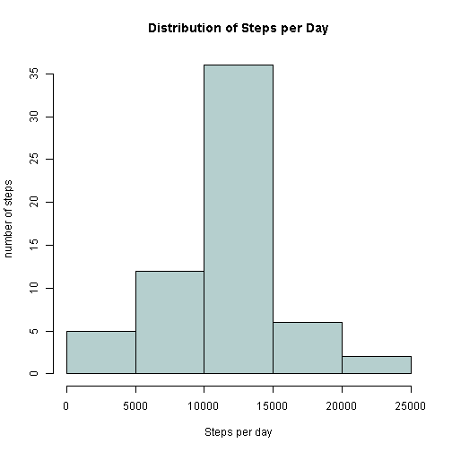
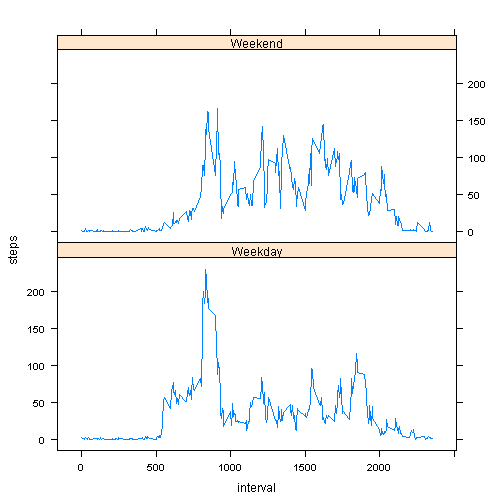

# Reproducible Research: Peer Assessment 1


```r
options(width = 600)
```


## 1. Loading and preprocessing the data

```r
# Read data and remove NAs
df <- read.csv("activity.csv", header=TRUE)
df.clean <- df[which(df$steps != "NA"), ]
```
## 2. What is mean total number of steps taken per day?

```r
total.per.day <- aggregate(x=df.clean$steps, by=list(Data =df.clean$date), FUN=sum)
colnames(total.per.day)[2] <- "tsteps"
hist(total.per.day$tsteps, main="Distribution of Steps per Day", xlab="Steps per day", ylab="number of steps", col="lightcyan2")
```

 

```r
# mean and median total number of steps taken per day
mean(total.per.day$tsteps)
```

```
## [1] 10766
```

```r
median(total.per.day$tsteps)
```

```
## [1] 10765
```
## What is the average daily activity pattern?

```r
interval.avg <- aggregate(x=df.clean$steps, by=list(df.clean$interval), FUN=mean)
colnames(interval.avg)[1] <- "interval"
colnames(interval.avg)[2] <- "avg"

plot(interval.avg$interval, interval.avg$avg, type="l", col="royalblue",
     xlab="5-minute interval", ylab="Average number of steps taken", main="Average daily activity pattern")
```

 

```r
# Which 5-minute interval, on average across all the days in the dataset, contains the maximum number of steps?
interval.avg[interval.avg$avg ==max(interval.avg$avg), 1]
```

```
## [1] 835
```

## Imputing missing values

```r
# Total number of missing values in the dataset
sum(is.na(df$steps))
```

```
## [1] 2304
```

```r
# Devise a strategy for filling in all of the missing values in the dataset. Join by 5-min interval
library(plyr)
```

```
## Warning: package 'plyr' was built under R version 3.0.3
```

```r
df.join <- join(df, interval.avg)
```

```
## Joining by: interval
```

```r
# Create a new dataset that is equal to the original dataset but with the missing data filled in. Using 5-min interval from prevoius join.
df.join$steps[is.na(df.join$steps)] <- df.join$avg[is.na(df.join$steps)]
df.new <- df.join[,c(1,2,3)]
rm(df.join)

# Histogram
spd <- aggregate(df.new$steps, by=list(df.new$date), FUN=sum)
colnames(spd)[1] <- "day"
colnames(spd)[2] <- "tsteps"
hist(spd$tsteps, main="Distribution of Steps per Day", xlab="Steps per day", ylab="number of steps", col="lightcyan3")
```

 

```r
# mean and median total number of steps taken per day
mean(spd$tsteps)
```

```
## [1] 10766
```

```r
median(spd$tsteps)
```

```
## [1] 10766
```

```r
sum(df.clean$steps)
```

```
## [1] 570608
```

```r
sum(df.new$steps)
```

```
## [1] 656738
```

```r
sum(df.new$steps) - sum(df.clean$steps)
```

```
## [1] 86130
```

```r
#Mean values didn't change. Compring resulting histograms, medians and totals, they are different.
```

## Are there differences in activity patterns between weekdays and weekends?

```r
library(lattice)
weekdays <- weekdays(as.Date(df.new$date ))
df.new <- transform(df.new, day=weekdays)
df.new$daytype <- ifelse(df.new$day %in% c("Saturday", "Sunday"),"Weekend", "Weekday")
daytype.avg <- ddply(df.new, .(interval, daytype), summarise, steps=mean(steps))

xyplot(steps ~ interval | daytype, data = daytype.avg, type="l", layout = c(1, 2))
```

 

